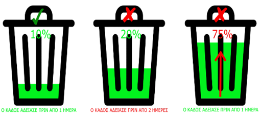
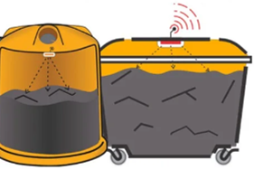

***4ο Δημοτικό Σχολείο Καλαμαριάς***

**Smart Garbage Monitoring System**

<html>

<body lang=EL link="#0563C1" vlink="#954F72">

Περιεχόμενα

<a href="#_Toc137899619">Εισαγωγή</a>

<a href="#_Toc137899620">Σενάριο
Χρήσης</a>

<a href="#_Toc137899621">Στόχος
Εφαρμογής</a>

<a href="#_Toc137899622">Προτεινόμενη
Λύση</a>

<a href="#_Toc137899623">Σενάριο&nbsp;Δραστηριότητας</a>

<a href="#_Toc137899624">Φάση
Προετοιμασίας</a>

<a href="#_Toc137899625">Φάση
σχεδιασμού</a>

<a href="#_Toc137899626">Δυσκολίες
που αντιμετωπίσαμε</a>

<a href="#_Toc137899627">Σε τι μας
βοηθάει</a>

<a href="#_Toc137899628">Κώδικας Arduino IDE</a>

<a href="#_Toc137899629">Μελλοντικές
εξελίξεις</a>

<a href="#_Toc137899630">Πλατφόρμες
που χρησιμοποιήθηκαν</a>

<a href="#_Toc137899631">Υλοποίηση</a>

<a href="#_Toc137899632">Φάση Δοκιμών</a>

<a href="#_Toc137899633">Συμπεράσματα</a>

&nbsp;

<b>&nbsp;</b>

<h1><a name="_Toc137899618">Περιεχόμενα</a></h1>

·&nbsp;&nbsp;&nbsp;&nbsp;&nbsp;&nbsp; <b>Εισαγωγή</b>

·&nbsp;&nbsp;&nbsp;&nbsp;&nbsp;&nbsp; <b>Σενάριο
Χρήσης</b>

·&nbsp;&nbsp;&nbsp;&nbsp;&nbsp;&nbsp; <b>Στόχος
Εφαρμογής</b>

·&nbsp;&nbsp;&nbsp;&nbsp;&nbsp;&nbsp; <b>Προτεινόμενη
Λύση</b>

·&nbsp;&nbsp;&nbsp;&nbsp;&nbsp;&nbsp; <b>Σενάριο Δραστηριότητας</b>

·&nbsp;&nbsp;&nbsp;&nbsp;&nbsp;&nbsp; <b>Φάση
Προετοιμασίας</b>

·&nbsp;&nbsp;&nbsp;&nbsp;&nbsp;&nbsp; <b>Φάση
Σχεδιασμού</b>

·&nbsp;&nbsp;&nbsp;&nbsp;&nbsp;&nbsp; <b>Σε τι μας
βοηθάει</b>

·&nbsp;&nbsp;&nbsp;&nbsp;&nbsp;&nbsp; <b>Δυσκολίες
που αντιμετωπίσαμε</b>

·&nbsp;&nbsp;&nbsp;&nbsp;&nbsp;&nbsp; <b>Μελλοντικές
εξελίξεις</b>

·&nbsp;&nbsp;&nbsp;&nbsp;&nbsp;&nbsp; <b>Κώδικας </b><b>Arduino
IDE</b>

·&nbsp;&nbsp;&nbsp;&nbsp;&nbsp;&nbsp; <b>Πλατφόρμες
που χρησιμοποιήθηκαν</b>

·&nbsp;&nbsp;&nbsp;&nbsp;&nbsp;&nbsp; <b>Υλοποίηση</b>

·&nbsp;&nbsp;&nbsp;&nbsp;&nbsp;&nbsp; <b>Φάση Δοκιμών</b>

·&nbsp;&nbsp;&nbsp;&nbsp;&nbsp;&nbsp; <b>Συμπεράσματα</b>

<h1><a name="_Toc137899619">Εισαγωγή</a></h1>

Η διαδικασία
της καθημερινής συλλογής των αστικών οικιακών απορριμμάτων στις μεγάλες κυρίως
πόλεις, μπορεί να «κρύβει» μια σπατάλη ενέργειας που στην σημερινή εποχή της
κλιματικής αλλαγής θα ήταν προτιμότερο να μπορούσαμε να την αποφύγουμε. Πιο
συγκεκριμένα οι υπάλληλοι που χειρίζονται τα μηχανήματα αποκομιδής σκουπιδιών
από τους γνωστούς μας κάδους, έχουν ένα καθημερινό δρομολόγιο μέσα στους
δρόμους μιας μεγαλούπολης, με σκοπό να αδειάσουν τους «πιθανώς» γεμάτους
κάδους από τα σκουπίδια. Ο σχεδιασμός της αποκομιδής, υποθέτει βάσει της
πρότερης εμπειρίας τους, ότι είναι τόσο γεμάτοι ώστε να μην μπορεί να
παραληφθούν για έστω και μία ημέρα , από τα μηχανήματα αποκομιδής. κατά την
κυκλοφορία τους καθημερινά μέσα στην πόλη.

Είναι όμως
ακριβώς έτσι;  Αν για παράδειγμα κάποιοι κάδοι , από τους οποίους περνάνε τα
μηχανήματα είναι μισοάδειοι και θα μπορούσαν να παραμείνουν μέχρι και την
επόμενη ημέρα, για να αδειάσουν , τότε μήπως το μηχάνημα αποκομιδής σπατάλησε
ενέργεια σε καύσιμα, χρόνο, ανθρωποώρες εργασίας από τους υπαλλήλους και
τελικώς επιβάρυνε και την κυκλοφορία της πόλης; Επιπλέον αν κάποιοι κάδοι λόγω
κάπου ειδικού και έκτακτου γεγονότος στην περιοχή, γέμισαν νωρίτερα από το
«προβλεπόμενο» χρόνο, τότε αυτή η «αλάνθαστη» καθημερινή εμπειρία χρήσης δεν
είναι τελικά η ενδεδειγμένη διαδικασία αποκομιδής απορριμμάτων μέσα σε μία
πόλη;

<h1><a name="_Toc137899620">Σενάριο Χρήσης</a></h1>

Ένας αισθητήρας υπερήχων (<i>ένας αισθητήρας απόστασης)</i> θα
τοποθετηθεί στην εσωτερική πλευρά του καπακιού, αυτή που βλέπει τα στερεά
απόβλητα. Καθώς τα σκουπίδια αυξάνονται, η απόσταση μεταξύ του υπερήχου και των
σκουπιδιών μειώνεται. Αυτά τα ζωντανά δεδομένα θα σταλούν στον μικροελεγκτή
μας.   Στη συνέχεια, ο μικροελεγκτής μας επεξεργάζεται τα δεδομένα και μέσω της
βοήθειας WiFi τα στέλνει σε μια εφαρμογή.

Αυτό που κάνει η εφαρμογή αντιπροσωπεύει οπτικά την ποσότητα των
σκουπιδιών στον κάδο με μια μικρή κινούμενη εικόνα.

Αυτή η διαδικασία θα υποδείξει όλους τους κάδους που απαιτούν
προσοχή, οδηγώντας τον χρήστη να ακολουθήσει την πιο αποτελεσματική διαδρομή. 

&nbsp;

&nbsp;

Σε κάθε κάδο υπάρχει ένας αισθητήρας , ο οποίος βλέπει πόσο γεμάτος είναι ο κάδος. Όταν ο κάδος είναι
γεμάτος τότε το τσιπάκι στέλνει μήνυμα μέσω Wi-Fi στην εφαρμογή.

Υλικά

<table class=MsoTableGrid border=1 cellspacing=0 cellpadding=0
 style='border-collapse:collapse;border:none'>
 <tr style='height:16.5pt'>
  <td width=193 valign=top style='width:144.75pt;border:solid windowtext 1.0pt;
  padding:0cm 5.4pt 0cm 5.4pt;height:16.5pt'>
  
Είδος

  </td>
  <td width=101 valign=top style='width:75.95pt;border:solid windowtext 1.0pt;
  border-left:none;padding:0cm 5.4pt 0cm 5.4pt;height:16.5pt'>
  
Ποσότητα

  </td>
 </tr>
 <tr style='height:16.5pt'>
  <td width=193 valign=top style='width:144.75pt;border:solid windowtext 1.0pt;
  border-top:none;padding:0cm 5.4pt 0cm 5.4pt;height:16.5pt'>
  
Arduino UNO R3 SMD

  </td>
  <td width=101 valign=top style='width:75.95pt;border-top:none;border-left:
  none;border-bottom:solid windowtext 1.0pt;border-right:solid windowtext 1.0pt;
  padding:0cm 5.4pt 0cm 5.4pt;height:16.5pt'>
  
5

  </td>
 </tr>
 <tr style='height:16.5pt'>
  <td width=193 valign=top style='width:144.75pt;border:solid windowtext 1.0pt;
  border-top:none;padding:0cm 5.4pt 0cm 5.4pt;height:16.5pt'>
  
Ultrasonic distance sensor

  </td>
  <td width=101 valign=top style='width:75.95pt;border-top:none;border-left:
  none;border-bottom:solid windowtext 1.0pt;border-right:solid windowtext 1.0pt;
  padding:0cm 5.4pt 0cm 5.4pt;height:16.5pt'>
  
5

  </td>
 </tr>
 <tr style='height:16.5pt'>
  <td width=193 valign=top style='width:144.75pt;border:solid windowtext 1.0pt;
  border-top:none;padding:0cm 5.4pt 0cm 5.4pt;height:16.5pt'>
  
9v Battery

  </td>
  <td width=101 valign=top style='width:75.95pt;border-top:none;border-left:
  none;border-bottom:solid windowtext 1.0pt;border-right:solid windowtext 1.0pt;
  padding:0cm 5.4pt 0cm 5.4pt;height:16.5pt'>
  
5

  </td>
 </tr>
 <tr style='height:16.5pt'>
  <td width=193 valign=top style='width:144.75pt;border:solid windowtext 1.0pt;
  border-top:none;padding:0cm 5.4pt 0cm 5.4pt;height:16.5pt'>
  
Jumper wires 40pcs

  </td>
  <td width=101 valign=top style='width:75.95pt;border-top:none;border-left:
  none;border-bottom:solid windowtext 1.0pt;border-right:solid windowtext 1.0pt;
  padding:0cm 5.4pt 0cm 5.4pt;height:16.5pt'>
  
5

  </td>
 </tr>
 <tr style='height:16.5pt'>
  <td width=193 valign=top style='width:144.75pt;border:solid windowtext 1.0pt;
  border-top:none;padding:0cm 5.4pt 0cm 5.4pt;height:16.5pt'>
  
LEDs 

  </td>
  <td width=101 valign=top style='width:75.95pt;border-top:none;border-left:
  none;border-bottom:solid windowtext 1.0pt;border-right:solid windowtext 1.0pt;
  padding:0cm 5.4pt 0cm 5.4pt;height:16.5pt'>
  
5

  </td>
 </tr>
 <tr style='height:16.5pt'>
  <td width=193 valign=top style='width:144.75pt;border:solid windowtext 1.0pt;
  border-top:none;padding:0cm 5.4pt 0cm 5.4pt;height:16.5pt'>
  
Breadboard

  </td>
  <td width=101 valign=top style='width:75.95pt;border-top:none;border-left:
  none;border-bottom:solid windowtext 1.0pt;border-right:solid windowtext 1.0pt;
  padding:0cm 5.4pt 0cm 5.4pt;height:16.5pt'>
  
5

  </td>
 </tr>
</table>

&nbsp;

<h1><a name="_Toc137899621">Στόχος
</a>Εφαρμογής</h1>

Ο Στόχος αυτής της εφαρμογής είναι να διευκολύνει τους ανθρώπους
που μαζεύουν τα σκουπίδια ή ακόμα και τους ανθρώπους για να πετάξουν τα σκουπίδια
τους.

<h1><a name="_Toc137899622">Προτεινόμενη Λύση</a></h1>

Η πιλοτική εφαρμογή που
προτείνουμε να δημιουργήσαμε αποτελεί μια ιδέα που μπορεί να εξοικονομήσει
ενέργεια κατά τη αποκομιδή και διαχείριση των οικιακών αποβλήτων αλλά και να
δημιουργήσει ένα πιο φιλικό αστικό και βιώσιμο αστικό περιβάλλον, μειώνοντας
την σπατάλη ενέργειας, τον θόρυβο, την επιβάρυνση του κυκλοφοριακού φόρτου της
πόλης από την άσκοπη μετακίνηση μηχανημάτων αποκομιδής, όταν αυτό μπορεί να
προβλεφθεί και να αποφευχθεί.

Αρχικά θα πρέπει πρώτα να εισάγουμε (ορίσουμε) το
ύψος του κάδου απορριμμάτων. Αυτό θα μας βοηθήσει να υπολογίσουμε το ποσοστό
των απορριμμάτων μέσα στον κάδο απορριμμάτων. Στη συνέχεια, έχουμε δύο κριτήρια
που πρέπει να πληρούνται για να δείξουμε ότι ο συγκεκριμένος κάδος πρέπει να
αδειάσει:

&nbsp;

1.&nbsp;&nbsp;
Ας πούμε ότι εάν ο κάδος σας είναι μισογεμάτος, δεν χρειάζεται
πραγματικά να τον αδειάσετε. Το σημείο πλήρωσης του κάδου, ή η μέγιστη ποσότητα
απορριμμάτων που επιτρέπουμε, είναι το 75% του κάδου. (Μπορείτε να οριστεί ανάλογα με τις επιλογές του χρήστη.)

&nbsp;

2.&nbsp;
Αν υποθέσουμε ότι ένας συγκεκριμένος κάδος απορριμμάτων γεμίζει
20% και μετά για μια εβδομάδα δεν αλλάζει, μπαίνει στο δεύτερο κριτήριό μας, ο
χρόνος. Με τον καιρό, ακόμη και η μικρή ποσότητα θα αρχίσει να σαπίζει,
οδηγώντας σε ένα δύσοσμο περιβάλλον. Για να αποφύγουμε το επίπεδο ανοχής μας να
είναι 2 ημέρες, επομένως εάν ένας κάδος απορριμμάτων είναι μικρότερος από 75%
αλλά είναι δύο ημερών, τότε θα πρέπει επίσης να αδειάσει.

&nbsp;

&nbsp;

&nbsp;

&nbsp;

&nbsp;

&nbsp;

<h1><a name="_Toc137899623">Σενάριο&nbsp;Δραστηριότητας</a></h1>

<b>&nbsp;</b>

Αριθμός
μαθητών: 7

Αριθμός
ομάδων: 1

Αριθμός
Ατόμων ανά ομάδα: 7

Είδος Δραστηριότητας:&nbsp;Ομαδοσυνεργατική

Ρόλοι:
Δεν υπάρχουν διακριτοί ρόλοι στην ομάδα

Ηλικιακή
Ομάδα: 11-12

&nbsp;

<h1><a name="_Toc137899624">Φάση Προετοιμασίας</a></h1>

Οι
μαθητές:

·&nbsp;&nbsp;&nbsp;&nbsp;&nbsp;&nbsp;
Βρήκαμε&nbsp;την&nbsp;ιδέα

·&nbsp;&nbsp;&nbsp;&nbsp;&nbsp;&nbsp;
Ορίσαμε&nbsp;τις&nbsp;προδιαγραφές&nbsp;της&nbsp;εφαρμογής

·&nbsp;&nbsp;&nbsp;&nbsp;&nbsp;&nbsp;
Σκεφτήκαμε&nbsp;τις&nbsp;λειτουργίες&nbsp;της&nbsp;εφαρμογής

·&nbsp;&nbsp;&nbsp;&nbsp;&nbsp;&nbsp;
Καταγράψαμε&nbsp;τις&nbsp;ανάγκες&nbsp;για&nbsp;υλικά

·&nbsp;&nbsp;&nbsp;&nbsp;&nbsp;&nbsp;
Παραγγείλαμε
τα&nbsp;υλικά

·&nbsp;&nbsp;&nbsp;&nbsp;&nbsp;&nbsp;
Προετοιμάσαμε
και αποστείλαμε την περίληψη για την συμμετοχή μας στον διαγωνισμό

&nbsp;

<h1><a name="_Toc137899625">Φάση σχεδιασμού</a></h1>

Η
συσκευή που θέλουμε να φτιάξουμε θα είναι φτιαγμένη από έναν αισθητήρα απόστασης
(ultrasonic sensor) ο οποίος θα τοποθετηθεί στο
καπάκι του κάδου και θα μετράει την ποσότητα των σκουπιδιών στον κάδο. Το
μηχάνημα θα ελέγχετε από το Arduino Uno R3.

&nbsp;

<h1><a name="_Toc137899626">Δυσκολίες που αντιμετωπίσαμε</a></h1>

Ήταν
αρκετά δύσκολο να δούμε πως συνδέεται το κάθε καλώδιο και το πως να το
συνδέσουμε με το Arduino UNO.
Επίσης ήταν αρκετά δύσκολο να προσαρμόσουμε τον κώδικα για να ταιριάζει στα
δικά μας δεδομένα.

<h1><a name="_Toc137899627">Σε τι μας βοηθάει</a></h1>

Η
βοήθειά του είναι μεγάλη διότι όποιος θέλει να αδειάσει τον κάδο θα μπορεί
απλώς να μπει στην εφαρμογή και να δει αν ο κάδος είναι γεμάτος ή άδειος τότε
θα τους διευκολύνει. Η εφαρμογή βοηθάει τους αυτούς τους φορείς, Όπως ο Δήμος, η περιφέρεια
και η γειτονιά. Γλυτώνει πολύ χρόνο.

<h1><a
name="_Toc137899628">Κώδικας </a>Arduino IDE   </h1>

&nbsp;

<h1><a name="_Toc137899629">Μελλοντικές εξελίξεις</a> </h1>

Θα
θέλαμε πολύ το Project μας να δημοσιευτεί στον Δήμο Καλαμαριάς και σε άλλους
Δήμους φυσικά για να διευκολύνει όλους τους εργάτες που δουλεύουν στα
απορριμματοφόρα.

&nbsp;

<h1><a name="_Toc137899630">Πλατφόρμες που χρησιμοποιήθηκαν</a></h1>

·&nbsp;&nbsp;&nbsp;&nbsp;&nbsp;&nbsp;
Tinkercad

·&nbsp;&nbsp;&nbsp;&nbsp;&nbsp;&nbsp;
Arduino
IDE

·&nbsp;&nbsp;&nbsp;&nbsp;&nbsp;&nbsp;
Prezi

·&nbsp;&nbsp;&nbsp;&nbsp;&nbsp;&nbsp;
Appinventor

<h1><a name="_Toc137899631">Υλοποίηση</a></h1>

Η
συσκευή φτιάχτηκε συνδέοντας το Arduino με τον Αισθητήρα  Ultrasonic sensor και τα LEDs. Στη συνέχεια τα βάλαμε όλα μέσα
στο κουτί και τα τοποθετήσαμε στον κάδο.

<h1><a name="_Toc137899632">Φάση Δοκιμών</a></h1>

Όταν
το κύκλωμα ήταν έτοιμο έπρεπε να δούμε αν δούλευε. Όταν κάναμε τις δύο τρείς
πρώτες δοκιμές δεν ήμασταν και τόσο ευχαριστημένοι. Όμως αργότερα όταν έγιναν
κάποιες από αυτές είμασταν περισσότερο ευχαριστημένοι. Κάποια από τα λαμπάκια
μερικές φορές άναβαν ενώ κάποιες άλλες όχι. Όταν πήγαινες πολύ κοντά το
αντικείμενο, στον αισθητήρα,  τότε άναβε το κόκκινο λαμπάκι, αν το πήγαινες
λίγο πιο μακριά άναβε το μπλε, αν ήταν μακριά στο ένα μέτρο άναβε το πράσινο
και αν ήταν μακριά από ένα μέτρο τότε δεν άναβε κανένα λαμπάκι. 

<h1><a name="_Toc137899633">Συμπεράσματα</a> </h1>

Καταλάβαμε
πόσο δύσκολο ήταν να αναλαμβάνεις κάτι τόσο μεγάλο γιατί είμαστε ακόμα πολύ
μικροί για να το καταλάβουμε και δεν μπορούμε να φτιάξουμε ολόσωστα αυτό το Project.

&nbsp;

</body>

</html>

**ΕΙΣΑΓΩΓΗ**

Η διαδικασία της καθημερινής συλλογής των αστικών οικιακών απορριμμάτων στις μεγάλες κυρίως πόλεις, μπορεί να «κρύβει» μια σπατάλη ενέργειας που στην σημερινή εποχή της κλιματικής αλλαγής θα ήταν προτιμότερο να μπορούσαμε να την αποφύγουμε. Πιο συγκεκριμένα οι υπάλληλοι που χειρίζονται τα μηχανήματα αποκομιδής σκουπιδιών από τους γνωστούς μας κάδους, έχουν ένα καθημερινό δρομολόγιο μέσα στους δρόμους μιας μεγαλούπολης, με σκοπό να αδειάσουν τους «πιθανώς» γεμάτους κάδους από τα σκουπίδια. Ο σχεδιασμός της αποκομιδής, υποθέτει βάσει της πρότερης εμπειρίας τους, ότι είναι τόσο γεμάτοι ώστε να μην μπορεί να παραληφθούν για έστω και μία ημέρα , από τα μηχανήματα αποκομιδής. κατά την κυκλοφορία τους καθημερινά μέσα στην πόλη.

Είναι όμως ακριβώς έτσι; Αν για παράδειγμα κάποιοι κάδοι , από τους οποίους περνάνε τα μηχανήματα είναι μισοάδειοι και θα μπορούσαν να παραμείνουν μέχρι και την επόμενη ημέρα, για να αδειάσουν , τότε μήπως το μηχάνημα αποκομιδής σπατάλησε ενέργεια σε καύσιμα, χρόνο, ανθρωποώρες εργασίας από τους υπαλλήλους και τελικώς επιβάρυνε και την κυκλοφορία της πόλης; Επιπλέον αν κάποιοι κάδοι λόγω κάπου ειδικού και έκτακτου γεγονότος στην περιοχή, γέμισαν νωρίτερα από το «προβλεπόμενο» χρόνο, τότε αυτή η «αλάνθαστη» καθημερινή εμπειρία χρήσης δεν είναι τελικά η ενδεδειγμένη διαδικασία αποκομιδής απορριμμάτων μέσα σε μία πόλη;

**ΠΡΟΤΕΙΝΟΜΕΝΗ ΛΥΣΗ**

Η πιλοτική εφαρμογή που προτείνουμε να δημιουργήσαμε αποτελεί μια ιδέα που μπορεί να εξοικονομήσει ενέργεια κατά τη αποκομιδή και διαχείριση των οικιακών αποβλήτων αλλά και να δημιουργήσει ένα πιο φιλικό αστικό και βιώσιμο αστικό περιβάλλον, μειώνοντας την σπατάλη ενέργειας, τον θόρυβο, την επιβάρυνση του κυκλοφοριακού φόρτου της πόλης από την άσκοπη μετακίνηση μηχανημάτων αποκομιδής, όταν αυτό μπορεί να προβλεφθεί και να αποφευχθεί.

Αρχικά θα πρέπει πρώτα να εισάγουμε (ορίσουμε) το ύψος του κάδου απορριμμάτων. Αυτό θα μας βοηθήσει να υπολογίσουμε το ποσοστό των απορριμμάτων μέσα στον κάδο απορριμμάτων. Στη συνέχεια, έχουμε δύο κριτήρια που πρέπει να πληρούνται για να δείξουμε ότι ο συγκεκριμένος κάδος πρέπει να αδειάσει:

1.  Ας πούμε ότι εάν ο κάδος σας είναι μισογεμάτος, δεν χρειάζεται πραγματικά να τον αδειάσετε. Το σημείο πλήρωσης του κάδου, ή η μέγιστη ποσότητα απορριμμάτων που επιτρέπουμε, είναι το 75% του κάδου. (Μπορείτε να οριστεί ανάλογα με τις επιλογές του χρήστη.)
2.  Αν υποθέσουμε ότι ένας συγκεκριμένος κάδος απορριμμάτων γεμίζει 20% και μετά για μια εβδομάδα δεν αλλάζει, μπαίνει στο δεύτερο κριτήριό μας, ο χρόνος. Με τον καιρό, ακόμη και η μικρή ποσότητα θα αρχίσει να σαπίζει, οδηγώντας σε ένα δύσοσμο περιβάλλον. Για να αποφύγουμε το επίπεδο ανοχής μας να είναι 2 ημέρες, επομένως εάν ένας κάδος απορριμμάτων είναι μικρότερος από 75% αλλά είναι δύο ημερών, τότε θα πρέπει επίσης να αδειάσει.

**ΣΕΝΑΡΙΟ ΧΡΗΣΗΣ**

Ένας αισθητήρας υπερήχων (A.K.A ένας αισθητήρας απόστασης) θα τοποθετηθεί στην εσωτερική πλευρά του καπακιού, αυτή που βλέπει τα στερεά απόβλητα. Καθώς τα σκουπίδια αυξάνονται, η απόσταση μεταξύ του υπερήχου και του σκουπιδιού μειώνεται. Αυτά τα ζωντανά δεδομένα θα σταλούν στον μικροελεγκτή μας.

Στη συνέχεια, ο μικροελεγκτής μας επεξεργάζεται τα δεδομένα και μέσω της βοήθειας WiFi τα στέλνει σε μια εφαρμογή.

Αυτό που κάνει η εφαρμογή εμφανίζει οπτικά την ποσότητα των σκουπιδιών στον κάδο με μια μικρή κινούμενη εικόνα.

Αυτή η διαδικασία θα υποδείξει όλους τους κάδους που απαιτούν προσοχή, οδηγώντας τον χρήστη να ακολουθήσει την πιο αποτελεσματική διαδρομή.

 

 
 

Σε κάθε κάδο υπάρχει ένας αισθητήρας Ultrasonic Distance Sensor, ο οποίος βλέπει γεμάτος είναι ο κάδος. Ανάλογα με το πόσο γεμάτος είναι (%) ο μικροελεγκτής Arduino στέλνει αντίστοιχο μήνυμα μέσω Wi-Fi στην εφαρμογή.

**ΥΛΙΚΑ**

|  **ΕΊΔΟΣ**                    | **ΠΟΣΟΤΗΤΑ**|
|-------------------------------|-------------| 
| Arduino UNO R3 SMD            |     5       |
| Base Shield V2                |     5       |
| Ultrasonic Distance Sensor    |     5       |
| Arduino MKR1000               |     5       |
| 9V Battery Clip (With On/Off) |     5       |
| Jumper Wires 40pcs            |     5       |
| Slide Switch (X2)             |     5       |
